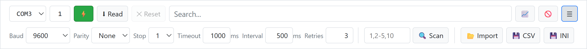
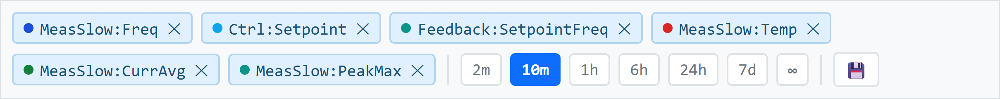

# 🥬🟣 Modra

**Modbus RTU client that generates its entire UI from a single CSV file.**

Modbus carries no metadata about registers. Type, unit, range and factory values live separately in firmware, client code, UI and docs. Modra closes that loop: one `regs.csv` describes every register, the entire client surface generates from it.

There is no per-device configuration UI. The grid, controls, validation rules and history schema all live in `regs.csv`. Change the file, restart, get a different device tool.

**Modes:**

- **Desktop**: `Modra.exe` via PyWebview
- **HTTP**: `py serve.py` → `localhost:8000`, any browser
- **Simulator**: pick the **SIM** port in the toolbar, no hardware

## Quick start

```bash
py -3.12 -m venv .venv
./.venv/Scripts/activate
py -m pip install -r requirements.txt
py api.py # desktop window
py serve.py # HTTP server
```

Or grab `Modra.exe` from [Releases](https://github.com/Xaeian/Modra/releases) and run it. It asks which `regs.csv` to use on startup, so the same binary serves any device - tick _don't ask again_ once you have settled on one.

First launch creates `serial.ini`, `view.json`, `data.db` next to the binary. History and UI state are keyed by register name, so an updated map keeps them; a genuinely different device wants **🧹 Clear DB**.

## The grid


**Controls by type:**

- **`uint`**/**`int`**/**`float`**/**`rule`**: numeric input, accepts `0x..` / `0b..`
- **`bool`**: HIGH / LOW buttons
- **`enum`**: one button per label, exclusive
- **`bits`**: one toggle per labeled bit, multi-select
- **`hex`**: input formatted as `0xNNNN`
- **`ver`**: read-only `X.YY.ZZ`

**Access badges:**

- 🟡**R**: read-only
- 🔴**W**: write-only
- 🔵**RW**: volatile read/write
- 🟢**RWs**: persisted read/write

**Visual states:**

- **yellow**: pending edit _(not sent)_
- **red outline**: out of range
- **blank**: rule register with no active slot
- **strikethrough**: ignored

**Row icons:**

- 🎯 stage the current value for **Send** _(even if unchanged)_
- 📊 add to chart
- 🚫 ignore _(stop polling, hide row)_
- ⚙ open slider tweaker _(editable scalar numerics only)_

## Toolbar



- ⚡ connect / disconnect
- ⬇ **Read** force full sync _(when no dirty edits)_
- ⬆ **Send(n)** flush pending edits to device
- ✕ **Reset** discard pending edits
- 📈 toggle chart panel
- 🚫 toggle show-disabled mode
- ☰ toggle settings panel

Connect flow: pick port → type address _(1-247)_ → **⚡**. Polling reads **R**/**RW**/**RWs** at the configured interval, and keeps retrying after a burst of read errors, so a transient bus glitch recovers on its own. Validation is advisory: the frontend marks out-of-range values and warns on **Send**, but the device is written whatever you typed.

## Charts



Click **📊** on any row. Registers sharing unit + scale share a panel; `bool`, `enum` and `bits` get their own panels.

- **range buttons**: `2m`/`10m`/`1h`/`6h`/`24h`/`7d`/`30d`/`1y`/`∞` _(all history)_
- **`S`**/**`M`**/**`L`**: cycle panel size
- **tag click**: remove trace
- 💾: export all series to CSV
- **drag on plot**: zoom in; the window refetches at a finer resolution, so detail appears as you go deeper
- **double-click**: back to the live edge

Each chart request is a time window, served from a resolution tier: raw for recent/narrow windows, minute/hour/day archives _(downsampled off raw)_ for wider ones. A year-wide overview is a few hundred points, not millions, and zooming refetches the new window at a finer tier. History comes from the local DB, so browsing works with no device connected.

## Hiding registers

- **🚫 on row**: ignore _(stop polling, hide row)_
- **🚫 in toolbar**: switch to show-disabled mode _(only ignored visible)_
- **🚫 on row in show-disabled mode**: un-ignore

History column is preserved; new rows after the ignore land as `NULL`. Membership stored in `view.json`.

## Settings ☰

- **Baud** / **Parity** / **Stop** / **Timeout**: wire-level, changing forces reconnect
- **Interval**: polling interval _(ms)_, drives both device polling and UI refresh rate
- **Retries**: per-block retry budget on read errors
- **History**: raw retention _(days)_; older data survives in coarser minute/hour/day archives
- **Address scan**: enter `1-10, 12, 100-110` → **🔍 Scan**, click result to connect
- **📂 Import**: load `.ini` / `.csv` into pending edits _(no auto-send; reads locale CSV with `;` + decimal comma)_
- **💾 CSV** / 💾 **INI**: export current RWs values to file
- **🧹 Clear DB**: wipe stored poll history _(data.db)_

## Keyboard shortcuts

Fire when nothing is focused _(Gmail / GitHub pattern)_, neighbours on QWERTY:

- **`i`**: **i**gnore mode _(toggle show-disabled)_
- **`o`**: **o**ptions _(toggle settings panel)_
- **`p`**: **p**lots _(toggle chart panel)_

## Files

| File | Role | Edited by |
|---|---|---|
| [`regs.csv`](regs.csv) | register map, source of truth _(format: [`modbus.md`](modbus.md))_ | you, or picked on first run |
| `serial.ini` | connection state | app + you |
| `view.json` | UI state _(monitor panels, ignored list)_ | app + you |
| `data.db` | SQLite poll history, one table per addr | app |
| `write.log` | audit log of every write | app |

**Schema change:** new `regs.csv` registers become DB columns automatically; a removed or retyped register is not migrated - delete `data.db` to rebuild.

## Simulator

Pick the **SIM** port from the toolbar dropdown _(always offered, no hardware)_. Address is set automatically; simulator history is kept in separate `addr_sim*` tables.

Each register is simulated from its own descriptor row alone _(type, rws, min/max)_, no cross-register logic:

- **numeric R**: mean-reverting random walk, edge-biased to stay in range
- **bool R**: rare random toggle
- **enum R**: rare advance to neighbour state
- **bits R**: rare random flip of individual labeled bits
- **hex / ver**: stable _(firmware-controlled)_
- **RW / RWs / W**: static, only user writes change them

## Build

```bash
py -3.12 -m venv .venv
./.venv/Scripts/activate
py -m pip install -r requirements.txt
./build.bat
```

`Modra.exe` lands in `.dist/`. Place next to `regs.csv` and run.
